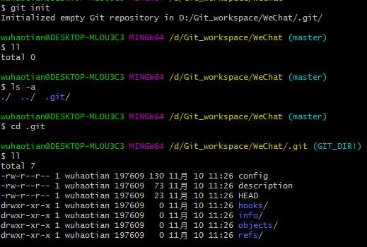

# Git和Github

它是一种版本控制的工具

### 版本控制工具应该具备的功能

1.协同修改

2.数据备份

3.版本管理

4.权限管理

​	对团队中参与开发的人员进行权限控制。 

​	对团队外开发者贡献的代码进行审核--Git 独有

5.历史记录

6.分支管理

​	允许开发团队在工作过程中多条生产线同时推进任务，进一步提高效率

### 版本控制是什么

工程设计领域中使用版本控制管理工程蓝图的设计过程。在 IT 开发过程中也可以 

使用版本控制思想管理代码的版本迭代。

集中式版本控制：SVN（存在单点故障问题）

分布式版本控制：Git（本地有完整的历史，避免单点故障）

## Git的优势：

​	1.大部分操作在本地完成，不需要联网 

​	2.完整性保证 

​	3.尽可能添加数据而不是删除或修改数据 

​	4.分支操作非常快捷流畅 

​	5.与 Linux 命令全面兼容


## Git命令行操作

### 1.本地库初始化

#### 	1.git init

​	

​	注意：.

​		git 目录中存放的是本地库相关的子目录和文件，不要删除，也不要胡 

​	乱修改。

### 2.设置签名

项目级别/仓库级别：仅在当前本地库范围内有效

```shell
git config user.name tom_pro 

git config user.email goodMorning_pro@atguigu.com
#信息保存位置：./.git/config 文件
```

系统用户级别：登录当前操作系统的用户范围

```sh
git config --global  user.name tom_glb 

git config --global goodMorning_pro@atguigu.com
#信息保存位置：~/.gitconfig 文件
```

### 3.基本操作

​	1.状态查看

`````shell
git status 
#查看工作区、暂存区状态
`````

​	2.添加

```shell
git add [file name] 
#将工作区的“新建/修改”添加到暂存区
```

​	3.提交

```shell
git commit -m "commit message" #[file name] 将暂存区的内容提交到本地库
```


​	4.查看历史记录

```shell
git log
git log --pretty=oneline#一行显示
git log --oneline#一行显示而且哈希值缩短
git reflog#显示HEAD@{移动到当前版本需要多少步}
```

多屏显示控制方式： 

空格向下翻页 

b 向上翻页 

q 退出 


​	5.前进和后退

```shell
#基于索引值操作[推荐] 
git reset --hard [局部索引值] 
git reset --hard a6ace91
#使用^符号：只能后退 
git reset --hard HEAD^ 
#注：一个^表示后退一步，n 个表示后退 n 步 
#使用~符号：只能后退 
git reset --hard HEAD~n 
#注：表示后退 n 步
```


​	6.reset命令的三个参数对比 

​		\--soft 参数 

​			 仅仅在本地库移动 HEAD 指针

​		--mixed 参数 

​			在本地库移动 HEAD 指针 

​			重置暂存区

​		--hard 参数 

​			在本地库移动 HEAD 指针 

​			重置暂存区 

​			重置工作区

​	7.删除文件并找回

```shell
#前提：删除前，文件存在时的状态提交到了本地库。
#操作：
git reset --hard [指针位置] 

删除操作已经提交到本地库：指针位置指向历史记录
删除操作尚未提交到本地库：指针位置使用 HEAD
```


​	8.比较文件差异

```shell
git diff [文件名]
# 将工作区中的文件和暂存区进行比较
git diff [本地库中历史版本] [文件名] 
# 将工作区中的文件和本地库历史记录比较 
# 不带文件名比较多个文件
```

### 4.分支管理

**什么是分支：**

在版本控制过程中，使用多条线同时推进多个任务。

分支在实际中有什么作用呢？假设你准备开发一个新功能，但是需要两周才能完成，第一周写了50%的代码，如果立刻提交，由于代码还没写完，不完整的代码库会导致别人不能干活了，如果等代码全部写完再一次性提交，又存在丢失每天进度的巨大风险。

现在有了分支，就不用怕了，你创建了一个属于你自己的分支，别人看不到，还继续在原来的分支上正常工作，而你在自己的分支上干活，想提交就提交，直到开发完毕后，再一次性合并到原来的分支上，这样，既安全，又不影响别人工作

**分支的好处？：**

1.同时并行推进多个功能开发，提高开发效率 

2.各个分支在开发过程中，如果某一个分支开发失败，不会对其他分支有任 何影响。失败的分支删除重新开始即可。

**分支操作：**

```shell
#创建分支
git branch [分支名] 
#查看分支
git branch -v 
#切换分支 
git checkout [分支名] 
# 合并分支 
	第一步：切换到接受修改的分支（被合并，增加新内容）上 
	git checkout [被合并分支名]
    第二步：执行 merge 命令 
    git merge [有新内容分支名]
#解决冲突 
	第一步：编辑文件，删除特殊符号
    第二步：把文件修改到满意的程度，保存退出 
    第三步：
    	git add [文件名] 
    第四步：
    	git commit -m "日志信息" 
    	注意：此时 commit 一定不能带具体文件名
```

## Github

```shell
git remote -v #查看当前所有远程地址别名
git remote add [别名] [远程地址]
git push [别名] [分支名] #推送
git origin [远程地址]  #克隆
效果：
	完整的把远程库下载到本地
	创建 origin 远程地址别名
	初始化本地库
	
拉取：
pull=fetch+merge
git fetch [远程库地址别名] [远程分支名]
git merge [远程库地址别名/远程分支名]
git pull [远程库地址别名] [远程分支名]
```

### 解决冲突：

1.如果不是基于 GitHub 远程库的最新版所做的修改，不能推送，必须先拉取。 

2.拉取下来后如果进入冲突状态，则按照分支冲突解决操作解决即可。

